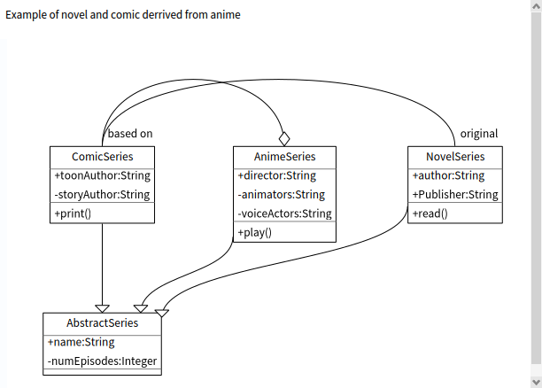

# MicroUML

A UML model and an embedded DSL in Pharo

MicroUML is a project to support a small syntax to describe class diagram. 

## Needs

Often we would like to describe simple class diagram in emails, discord or other textual channels.
But we do not want to have load a specific parser infrastructure to be able to manipulate it. 

## Design 
MicroUML has been designed during ESUG 2025 at Gdansk with the following constraints

- only use the Pharo syntax
- be compact

### Syntax

#### Class definition
Class definition starts with `#` and conceptually produces a UmlClassBox

```
#AbstractSeries 
```

```
#AbstractSeries
    --|> #Manga
```

#### Members

The message -, +, * are used to add members to a UmlClassBox

```
#AbstractSeries
    - #read~{}
    + #printOn:~{s @Stream}
```

#### Class variable and class methods

```
#AbstractSeries
    $ ClassVar @ #Float
    + #(static) % #findByName ~ {#String} @ #AbstractSeries
```

#### Relations

- ` --|> ` defines subclass
- ` ---<'comicalize'> ` composition

```
#AnimeSeries
    --|> #AbstractSeries 
    <'original'>---<'comicalize'> #ComicSeries 
    <><'main'>---<'side stories'> #NovelSeries 
```

#### Class sequences

We use `===` to link multiple class definitions. 

```pharoscript
#AbstractSeries 
    + #name @ String 
    * #numEpisodes @ Integer
=== 
#NovelSeries 
    --|> #AbstractSeries
    + #author @ String 
    + #Publisher @ String 
    + #read~{}
```

### Considerations 
We decided to avoid to manipulate classes as the receiver in the class definition (`Object << #Point` and not `#Object << #Point`)
This is why we extensively use Symbols. This gives regularity and writers do not have to know if the classes they refer exist or not. 


## Example

The following UML diagram is produced by executing (and not having a dedicated parser) 
the following Pharo code snippet.





Here is the Pharo program that creates a metamodel that can be rendered as the previous figure.

```pharoscript
#AbstractSeries 
    + #name @ String 
    * #numEpisodes @ Integer
=== 
#NovelSeries 
    --|> #AbstractSeries
    + #author @ String 
    + #Publisher @ String 
    + #read~{}
=== 
#ComicSeries 
    --|> #AbstractSeries 
    + #toonAuthor @ String
    #storyAuthor @ String + #print~{}
=== 
#AnimeSeries
    --|> #AbstractSeries 
    + #director @ String 
    #animators @ String
    #voiceActors @ String
    + #play~{} <>---<'based on'> #ComicSeries
=== 
#ComicSeries ---<'original'> #NovelSeries 

    extent: 600 @ 400
```


```
| uml builder |
uml := 
#(abstract) % #AbstractSeries 
    + #name @ String 
    - #(abstract) % #numEpisodes @ Integer
    + #(static) % #findByName ~ {#String} @ #AbstractSeries
=== 
#NovelSeries 
    --|> #AbstractSeries
    + #author @ String 
    * #Publisher @ String 
    + #read~{}
=== 
#ComicSeries 
    --|> #AbstractSeries 
    + #toonAuthor @ String
    * #storyAuthor @ String 
    + #print~{} 
=== 
#AnimeSeries
    --|> #AbstractSeries 
    + #director @ String 
    - #animators @ String
    - #voiceActors @ String 
    + #play~{} 
    <'original'>---<'comicalize'> #ComicSeries 
    <><'main'>---<'side stories'> #NovelSeries .
    builder := MicroUMLRoassalBuilder new
                   astBuilder: uml;
                   build.
    builder
        @ RSCanvasController;
        open
```


## Loading
Watch out we want to integrate it into Pharo so the repository will probably change.


```
Metacello new
  baseline: 'MicroUML';
  repository: 'github://olekscode/MicroUML/src';
  load.
```

## If you want to depend on it

```
  spec 
    baseline: 'MicroUML' 
    with: [ spec repository: 'github://olekscode/MicroUML/src' ].
```


## Authors

S. Ducasse, T. Oda, O. Zaitsev
